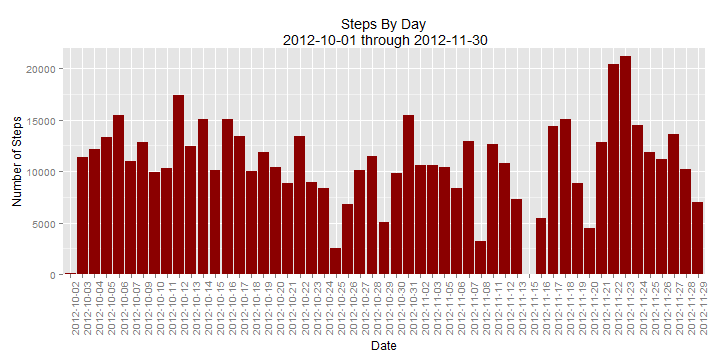
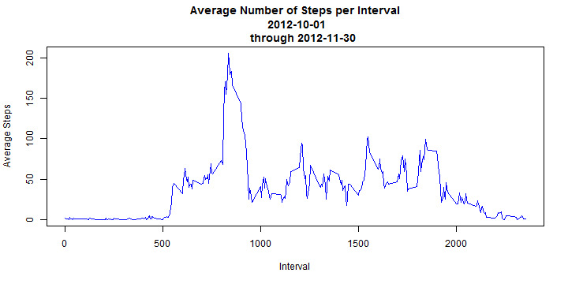
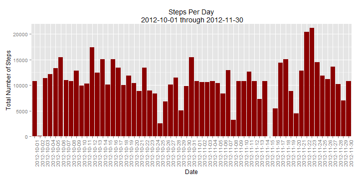
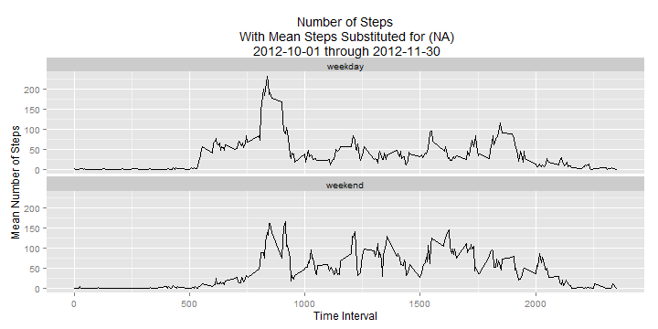

# Reproducible Research Peer Assessment 1#

This document addresses the tasks assigned in Peer Assessment 1 of the Coursera/Johns Hopkins course Reproducable Research. 


## Loading and preprocessing the data ##
Show any code that is needed to

    1. Load the data (i.e. read.csv())
    2. Process/transform the data (if necessary) into a format suitable for your analysis


```r
# Load the required packages
require(dplyr)
```

```
## Loading required package: dplyr
## 
## Attaching package: 'dplyr'
## 
## The following object is masked from 'package:stats':
## 
##     filter
## 
## The following objects are masked from 'package:base':
## 
##     intersect, setdiff, setequal, union
```

```r
require(ggplot2)
```

```
## Loading required package: ggplot2
## Find out what's changed in ggplot2 with
## news(Version == "1.0.1", package = "ggplot2")
```

```r
require(timeDate)
```

```
## Loading required package: timeDate
```

```r
# Download the raw data file from the supplied URL
# download.file("http://d396qusza40orc.cloudfront.net/repdata%2Fdata%2Factivity.zip", "activity.zip", mode = "wb")

# Unzip the downloaded file
unzip("activity.zip")

# Read the data from th downloaded file into a data frame
rawDataFrame <- read.csv("activity.csv")
```


## What is mean total number of steps taken per day? ##
For this part of the assignment, you can ignore the missing values in the dataset.

    1. Calculate the total number of steps taken per day
    2. If you do not understand the difference between a histogram and a barplot, research the
    difference between them. Make a histogram of the total number of steps taken each day
    3. Calculate and report the mean and median of the total number of steps taken per day


```r
# create new data frame without observations containing NA's
sansNAs <- rawDataFrame[complete.cases(rawDataFrame), ]

# Group the new data frames data by date and sum the total steps for each date
stepsByDay <- summarise(group_by(sansNAs,date), sum(steps))

# name the new data frames columns "date" & "steps"
colnames(stepsByDay) <- c("date","steps")

# Plot a histogram of the steps taken each day
g <- ggplot(stepsByDay, aes(date,steps)) +
        geom_histogram(stat="identity",fill="red4") +
        coord_cartesian(ylim = c(0,22000)) +
        theme(axis.text.x = element_text(angle = 90, hjust = 1)) +
        labs(y=expression("Number of Steps")) +
        labs(x=expression("Date")) +
        labs(title="Steps By Day\n 2012-10-01 through 2012-11-30")      
 print(g)
```

 

```r
# Calculate the mean of the steps taken per day
meenSteps <- as.integer(mean(stepsByDay$steps))

# Caalculate the median of the steps taken per day
midSteps <- median(stepsByDay$steps)

# *** the numbers for the mean and median reported below ***
# *** are inserted via `r meenSteps` & `r midSteps`      ***
```
The instructions state "For this part of the assignment, you can ignore the missing values in the dataset.", therefore, a new data frame is created with all observations containing NA's removed. The resulting data is grouped by date, summed, and presented in a histogram graph.

The mean number of total steps taken per day is 10766 . The median is 10765 . Fractional portions of the values are truncated, as a fraction of a step is not relevant in the real world


## What is the average daily activity pattern?##

    1. Make a time series plot (i.e. type = "l") of the 5-minute interval (x-axis) and the
    average number of steps taken, averaged across all days (y-axis)
    2. Which 5-minute interval, on average across all the days in the dataset, contains the
    maximum number of steps?


```r
# Group the data without NA's by the 5 minute intervals 
# then calculate the mean steps for each interval
avgSteps <- summarise(group_by(sansNAs, interval),mean=mean(steps))

# Plot a time series line graph of the data 
plot(avgSteps$interval,avgSteps$mean,col="blue",type="l",xlab="Interval",
     ylab="Average Steps", main="Average Number of Steps per Interval\n 2012-10-01
     through 2012-11-30")  
```

 

```r
# Sort the data frame in order to determine which 5 minute interval has the
# maximum mean steps
maxSteps <- arrange(avgSteps,desc(mean))

# ***  The number below is inserted using the code `r maxSteps[1,1]`  ***
```

The Data without NA's was grouped by the 5 minute intervals 
and the mean steps for each interval were calculated. Using the
calculated mean steps for each interval, a time series line graph
of the data was plotted.

The interval with the most steps on average is 835 .


## Imputing missing values ##

Note that there are a number of days/intervals where there are missing values (coded as NA). The presence of missing days may introduce bias into some calculations or summaries of the
data.

    1. Calculate and report the total number of missing values in the dataset (i.e. the total
    number of rows with NAs)
    2. Devise a strategy for filling in all of the missing values in the dataset. The strategy
    does not need to be sophisticated. For example, you could use the mean/median for that day,
    or the mean for that 5-minute interval, etc.
    3. Create a new dataset that is equal to the original dataset but with the missing data
    filled in.
    4. Make a histogram of the total number of steps taken each day and Calculate and report
    the mean and median total number of steps taken per day. Do these values differ from the
    estimates from the first part of the assignment? What is the impact of imputing missing
    data on the estimates of the total daily number of steps?


```r
# Scan rawDataFrame steps column. Create a logical vector containing 
# TRUE for observations with NA and FALSE for observations with data. 
# Name the vector hasNAs.
hasNAs <- is.na(rawDataFrame$steps)

# Calculate the number of observations with missing data
numberHasNAs <- sum(hasNAs)

# Store only the observation names that have NA. (Eliminate the observation names with data.) 
hasNAs <- which(hasNAs %in% 1)

# Make a copy of rawDataFrame
modifiedRaw.df <- rawDataFrame

# Set up a loop to process the observations with NA's. 
for(i in 1:length(hasNAs)) {
        # Look up the inverval number for the current observation name in the rawDataFrame
        # Find that interval's row name in the avgSteps data frame. Store the
        # interval's row name in avgStepsRow
        avgStepsRow <- which(avgSteps$interval == rawDataFrame[hasNAs[i],3])
        # Look up avgStepsRow in avgSteps. Find and store the mean number of steps for that
        # interval in the data frame named modifiedRaw.df
        modifiedRaw.df[hasNAs[i],1] <- avgSteps[avgStepsRow,2]
}

# Group the data by date and sum the steps for each day
stepsPerDay <- summarise(group_by(modifiedRaw.df,date), sum(steps))

# Define column names for the data frame
colnames(stepsPerDay) <- c("date","steps")

# Plot the number of steps taken each day in a histogram graph
g <- ggplot(stepsPerDay, aes(date,steps)) +
        geom_histogram(stat="identity",fill="red4") +
        coord_cartesian(ylim = c(0,22000)) +
        theme(axis.text.x = element_text(angle = 90, hjust = 1)) +
        labs(y=expression("Total Number of Steps")) +
        labs(x=expression("Date")) +
        labs(title="Steps Per Day\n 2012-10-01 through 2012-11-30")      
 print(g)
```

 

```r
# Calculate  the mean and median number of steps per day
meenSteps2 <- as.integer(mean(stepsPerDay$steps))
midSteps2 <- as.integer(median(stepsPerDay$steps))
```

The original data set contained 2304  observations with 
missing data.  The calculations in this section will be conducted with 
a modified data set using the mean steps per interval to replace missing
data. To accomplish this the rawDataFrame steps column was scanned. A 
logical vector containing TRUE for observations with NA and FALSE for 
observations with data was created. The vector was named "hasNAs". The 
number of observations with missing data was summed and reported above.
Only the observation names that have NA were stored eliminating the 
observation names with data.

A copy of the rawDataFrame was made (modifiedRaw.df) and a loop was set up to process the 
bservations with NA's. The loop:

    1. Looked up the inverval number for the current observation name in the rawDataFrame.
    2. Found the interval's row name in the avgSteps data frame.
    3. Stored the interval's row name in avgStepsRow.
    4. Looked up avgStepsRow in avgSteps.
    5. Found and stored the mean number of steps for that interval in the data frame named
    modifiedRaw.df
           
Column names for the data frame were defined and a histogram graph ploted for the number of
steps taken each day.

The mean number of total steps taken per day is 10766 . The median is 10766 . Fractional portions of the values are truncated, as a fraction of a step is not relevant in the real world. 

The resulting mean and median number of steps per day were virturally identical to the data set with missing values ignored. It would appear that substituting mean values for the missing data served to reinforce the mean and median values.

## Are there differences in activity patterns between weekdays and weekends?##

For this part the weekdays() function may be of some help here. Use the dataset with the filled-in missing values for this part.

    1. Create a new factor variable in the dataset with two levels - "weekday" and "weekend"
    indicating whether a given date is a weekday or weekend day.
    2. Make a panel plot containing a time series plot (i.e. type = "l") of the 5-minute
    interval (x-axis) and the average number of steps taken, averaged across all weekday days
    or weekend days (y-axis).


```r
# Add a column identifing each observation as occuring on the
# weekend or weekday
modifiedRaw.df$dayClass <- ifelse(isWeekday(modifiedRaw.df$date),"weekday","weekend")
# Make the dayClass column class factor
modifiedRaw.df$dayClass <- as.factor(modifiedRaw.df$dayClass)
# calculate the mean for each interval by weekend and weekday
avgSteps2 <- summarise(group_by(modifiedRaw.df, interval,dayClass),mean=mean(steps))

# Plot the data calculated above on a time series line graph
g <- ggplot(avgSteps2, aes(interval,mean)) +
        geom_line(stat="identity") +
        facet_wrap(~dayClass,nrow=2)+
        labs(y=expression("Mean Number of Steps")) +
        labs(x=expression("Time Interval")) +
        labs(title="Number of Steps\n With Mean Steps Substituted for (NA)\n 2012-10-01 through 2012-11-30")      

        print(g)
```

 


A column was added to the data set with values substituted for NA's. In the column each observation is identified as occuring on the weekend or weekday. The column class was coereced as a factor. The total steps for each interval was calculated y weekend and weekday. The data calculated above was plotted time series line graph comparing the weekend steps to weekday steps. While it appears that activity begins later in the day on weekends, the activity seems to occur at a higher level through out the day.

